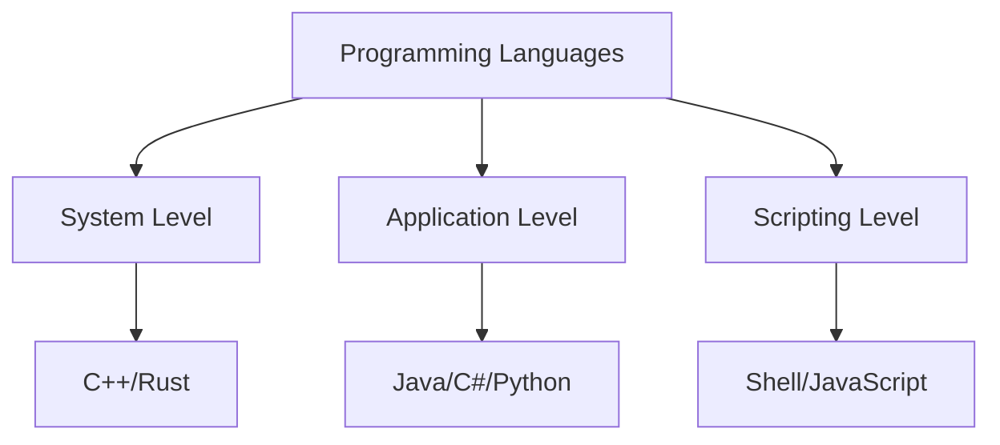
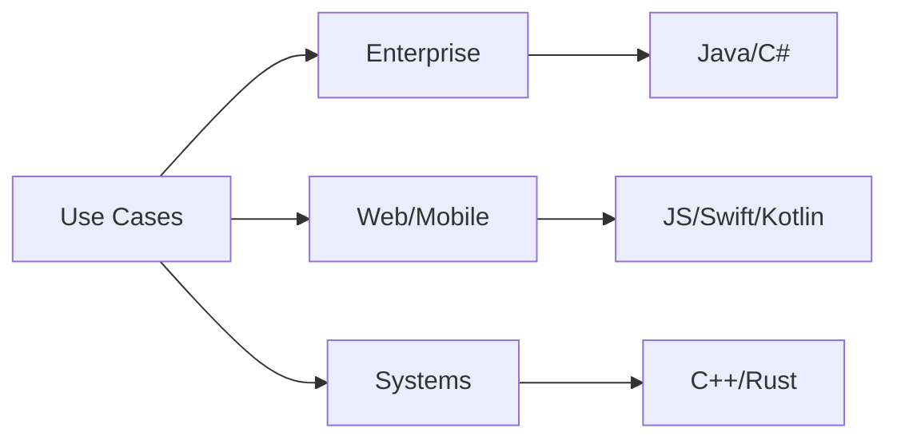
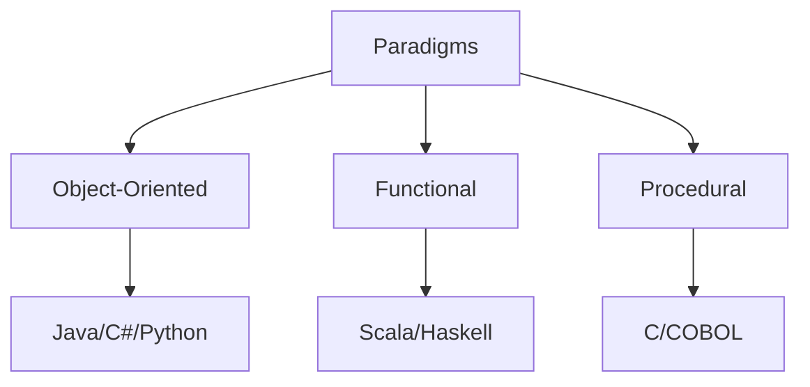
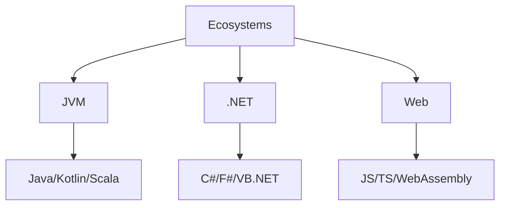

# Programming-Languages

A collection of code samples, templates, and best practices for various programming languages.

## Languages Included
- COBOL
- C++
- C#
- Dart
- Go
- Java
- JavaScript
- Kotlin
- Low-code
- PHP
- Python
- R
- Ruby
- Rust
- Scala
- Shell
- SQL
- Swift
- TypeScript
- VB.NET

## Getting Started
Browse the language-specific folders for README files and code samples.

## Contributing
See [CONTRIBUTING.md](CONTRIBUTING.md) for guidelines.

## Code of Conduct
See [CODE_OF_CONDUCT.md](CODE_OF_CONDUCT.md).

## License
This project is licensed under the terms of the LICENSE file.

## Badges

## Changelog
See [CHANGELOG.md](CHANGELOG.md) for release history.

## ⭐ Give a Star!
If you find this repository helpful or are using it to learn programming languages, please give it a star. Thanks!

## 📋 Table of Contents
- [Language Categories](#-language-categories)
- [Language Use Cases](#-language-use-cases)
- [Language Paradigms](#-language-paradigms)
- [Language Ecosystems](#-language-ecosystems)
- [Core Areas](#-core-areas)
  - [System Level Languages](#system-level-languages)
  - [Application Level Languages](#application-level-languages)
  - [Scripting Languages](#scripting-languages)
  - [Domain Specific Languages](#domain-specific-languages)
  - [Modern Enterprise Languages](#modern-enterprise-languages)
  - [Web Development Languages](#web-development-languages)
  - [Mobile & Cross-Platform](#mobile--cross-platform)
  - [Low-Code Solutions](#low-code-solutions)
- [How to Use This Repository](#-how-to-use-this-repository)
- [Project Ideas](#-project-ideas)
- [Learning Resources](#-learning-resources)
- [Contributing](#-contributing)
- [License](#-license)

## ⚠️ Disclaimer
> This repository aims to provide a structured learning path for programming languages and frameworks. The content is designed to guide you in understanding core concepts and practical implementation, rather than promoting specific tools or frameworks. Remember that development practices evolve rapidly - always verify information and stay updated with the latest developments.

## 📊 Programming Language Overview

### Language Categories

### Language Use Cases

### Language Paradigms

### Language Ecosystems

## 📚 Core Areas

### System Level Languages
- [C++ Resources](./cpp/README.md)
  - System Programming
  - Memory Management
  - Performance Optimization
  - Low-level Development

- [Rust Resources](./rust/README.md)
  - Systems Programming
  - Memory Safety
  - Concurrent Programming
  - WebAssembly Development

### Application Level Languages
- [Java Resources](./java/README.md)
  - Core Java
  - Spring Framework
  - Enterprise Development
  - Cloud Integration

- [Python Resources](./python/README.md)
  - AI/ML Development
  - Data Science
  - Cloud Automation
  - Enterprise Applications

- [C# Resources](./csharp/README.md)
  - .NET Core
  - Azure Integration
  - Enterprise Applications
  - Cloud Services

### Scripting Languages
- [Shell Scripting Resources](./shell/README.md)
  - Bash/PowerShell
  - Cloud Automation
  - DevOps Tools
  - Infrastructure Automation

- [JavaScript Resources](./javascript/README.md)
  - Modern JavaScript (ES6+)
  - Node.js
  - Frontend Frameworks
  - Browser Development

- [TypeScript Resources](./typescript/README.md)
  - Type System
  - Enterprise JavaScript
  - Framework Integration
  - Cloud Development

### Domain Specific Languages
- [SQL Resources](./sql/README.md)
  - Database Management
  - Query Optimization
  - Data Analysis
  - Business Intelligence

- [R Resources](./r/README.md)
  - Statistical Computing
  - Data Analysis
  - Scientific Computing
  - Machine Learning

### Modern Enterprise Languages
- [Go Resources](./go/README.md)
  - Cloud-Native Development
  - Microservices
  - High-Performance Services
  - System Tools

- [Scala Resources](./scala/README.md)
  - Big Data Processing
  - Functional Programming
  - Concurrent Systems
  - JVM Integration

### Web Development Languages
- [PHP Resources](./php/README.md)
  - Web Development
  - Content Management
  - Server-side Scripting
  - Enterprise Web

- [Ruby Resources](./ruby/README.md)
  - Ruby on Rails
  - Web Development
  - Scripting
  - DevOps Tools

### Mobile & Cross-Platform
- [Swift Resources](./swift/README.md)
  - iOS Development
  - macOS Development
  - Apple Ecosystem
  - Mobile Apps

- [Kotlin Resources](./kotlin/README.md)
  - Android Development
  - Cross-platform
  - Server-side
  - JVM Development

- [Dart Resources](./dart/README.md)
  - Flutter Development
  - Cross-platform Apps
  - Mobile Development
  - UI/UX

### Low-Code Solutions
- [Low-Code/No-Code Resources](./lowcode/README.md)
  - Power Platform
  - Mendix
  - OutSystems
  - Citizen Development

## 📚 Learning Resources

### YouTube Channels
- [Programming with Mosh](https://www.youtube.com/c/programmingwithmosh)
- [Traversy Media](https://www.youtube.com/user/TechGuyWeb)
- [The Net Ninja](https://www.youtube.com/c/TheNetNinja)
- [freeCodeCamp](https://www.youtube.com/c/Freecodecamp)
- [Derek Banas](https://www.youtube.com/user/derekbanas)
- [Fireship](https://www.youtube.com/c/Fireship)
- [Tech With Tim](https://www.youtube.com/c/TechWithTim)

### Blogs & Newsletters
- [Dev.to](https://dev.to/)
- [Medium Programming](https://medium.com/topic/programming)
- [HackerNoon](https://hackernoon.com/)
- [The Practical Dev](https://dev.to/)
- [Programming Digest](https://programmingdigest.net/)
- [TLDR Newsletter](https://tldr.tech/)
- [Official Language Blogs](https://blog.rust-lang.org/)

### Podcasts
- [CodeNewbie](https://www.codenewbie.org/podcast)
- [Syntax.fm](https://syntax.fm/)
- [Programming Throwdown](https://www.programmingthrowdown.com/)
- [Talk Python To Me](https://talkpython.fm/)
- [.NET Rocks](https://www.dotnetrocks.com/)
- [Go Time](https://changelog.com/gotime)
- [The Rust Programming Language Podcast](https://rustacean-station.org/)

### Books
- "Structure and Interpretation of Computer Programs"
- "Clean Code: A Handbook of Agile Software Craftsmanship"
- "Programming Language Pragmatics"
- "The C Programming Language"
- "Effective Java"
- "Python Crash Course"
- "JavaScript: The Good Parts"

### Development Tools
- IDEs & Editors
  - Visual Studio
  - IntelliJ IDEA
  - VS Code
  - Eclipse
  - PyCharm
- Version Control
  - Git
  - GitHub
  - GitLab
  - Bitbucket
- CI/CD Tools
  - Jenkins
  - GitHub Actions
  - GitLab CI
  - Azure DevOps
- Cloud Platforms
  - AWS
  - Azure
  - Google Cloud
  - IBM Cloud

## 🚀 Project Ideas

### Beginner Projects
- Web Applications
  - Personal Portfolio
  - Task Manager
  - Blog Platform
  - E-commerce Site
- Mobile Apps
  - Weather App
  - Note Taking
  - Fitness Tracker
  - Social Media Client

### Intermediate Projects
- Enterprise Applications
  - CRM System
  - Inventory Management
  - HR Portal
  - Analytics Dashboard
- Cloud Projects
  - Serverless API
  - Container Orchestration
  - CI/CD Pipeline
  - Monitoring System

### Advanced Projects
- Distributed Systems
  - Microservices Architecture
  - Message Queue System
  - Service Mesh
  - Data Pipeline
- AI/ML Projects
  - Recommendation Engine
  - Fraud Detection
  - Image Recognition
  - Natural Language Processing

## 🤝 Contributing

Feel free to contribute by:
1. Adding new resources
2. Updating existing materials
3. Fixing errors or broken links
4. Improving documentation
5. Adding enterprise use cases

Please read our [Contributing Guidelines](CONTRIBUTING.md) before submitting a PR.

## 📝 License

This repository is licensed under the MIT License - see the [LICENSE](LICENSE) file for details.

## 👤 Author & Maintainer

This repository is maintained by [Donnivis Baker](https://github.com/dbsectrainer). For questions or feedback, please open an issue or reach out directly.

---
Last Updated: February 2025
